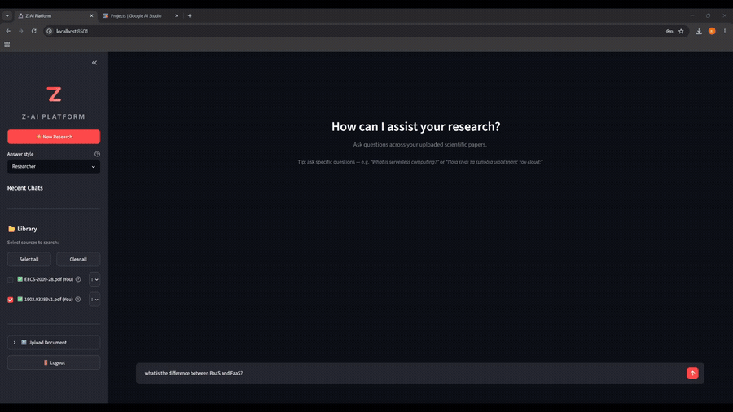
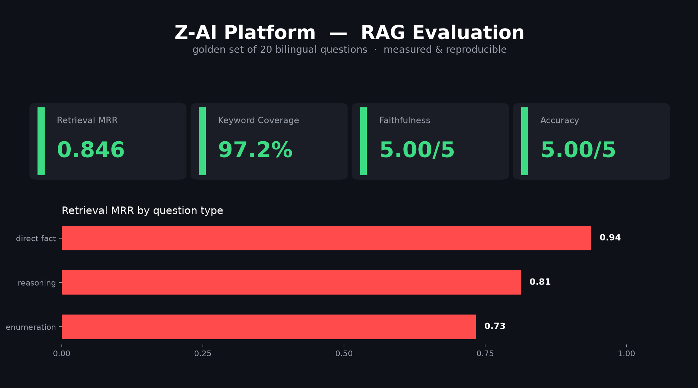

# Z-AI Platform

[](https://github.com/kostas221/local-rag-assistant/actions/workflows/ci.yml)

A local-first **RAG (Retrieval-Augmented Generation) platform** for scientific documents: upload PDFs, ask questions in natural language (Greek or English), and get evidence-based answers with page-level citations — powered by a fully local retrieval stack and Gemini for generation.

Built as a diploma thesis project focusing on **cross-lingual retrieval quality** and **measurable, reproducible evaluation**.

> 📊 **Headline results** (50-question bilingual golden set, deterministic): LLM-judge **5.00 / 4.98 / 5.00 / 5.00** on accuracy, completeness, relevance & faithfulness · **100% keyword coverage** · **zero hallucinations** — all 5 out-of-corpus probes correctly refused · warm retrieval **450 ms** and time-to-first-token **2.78 s**, both down from 15 s+ — [details below](#evaluation-results)

## Demo



> Upload a PDF, ask in Greek or English, and get grounded answers with page-level citations — plus a clear *"not found"* when the answer isn't in the documents.

## Features

- **Hybrid retrieval** — dense semantic search (BAAI/bge-m3, 1024-dim, cosine) fused with lexical BM25 via Reciprocal Rank Fusion (RRF)
- **Exact vector search** — brute-force cosine over the full index instead of ANN. Measured: identical top-30 to HNSW (30/30, same order) with no speed cost at this corpus size, and *deterministic* across processes
- **Cross-encoder reranking** — `ms-marco-MiniLM-L-6-v2` reorders fused candidates. English-only by design: the pipeline translates before retrieval, so a multilingual reranker paid for capability it never used
- **Anti-hallucination relevance gate** — if even the best chunk scores below a *measured* threshold, the system answers "not found" instead of feeding irrelevant context to the LLM. Calibrated from the score gap between in-corpus and out-of-corpus questions, not guessed
- **Cross-lingual QA** — Greek questions are translated for retrieval over English papers (translate-then-retrieve, permanently cached); answers come back in the user's language
- **Greek-aware BM25** — accent-stripping tokenizer so unaccented queries still match
- **Robust PDF extraction** — PyMuPDF with Unicode NFKC normalization and de-hyphenation. Fixes broken intra-word spacing (`A WS` → `AWS`), ligatures, and line-break hyphens that silently break both lexical and semantic matching
- **Built-in evaluation framework** — retrieval metrics (MRR, nDCG, keyword coverage), LLM-as-judge answer scoring, RAGAS cross-validation, a determinism checker, and a CI regression gate
- **Feedback capture** — 👍/👎 on every answer with an optional comment, upserted per message in Postgres — ground truth for error analysis
- **Phased status** — the UI reports pipeline progress live (🔍 searching → ✍️ composing) while the answer streams
- **Multi-user** — JWT auth, per-user document ownership, public/private sharing, login rate limiting
- **Observability** — request IDs, per-phase latency (retrieval vs generation), token usage logging

## Architecture

```
┌────────────┐  HTTP   ┌─────────────────────────────────┐
│  Streamlit │ ──────► │            FastAPI               │
│  frontend  │         │                                  │
│   :8502    │         │  /chat ──► RAG pipeline          │
└────────────┘         │  /upload ─► background ingest    │
                       └──────┬──────────┬───────────┬────┘
                              │          │           │
                       ┌──────▼───┐ ┌────▼─────┐ ┌───▼────────┐
                       │ ChromaDB │ │ Postgres │ │ Gemini 2.5 │
                       │ (chunks, │ │ (users,  │ │   Flash    │
                       │ vectors) │ │  chats)  │ │ (gen+judge)│
                       └──────────┘ └──────────┘ └────────────┘
```

### RAG pipeline (per question)

1. **Query optimization** — Greek questions translated to English search queries (permanently cached to disk, so the same question always yields the same retrieval)
2. **Dense search** — bge-m3 embeddings, exact cosine over the whole index, top-30
3. **Sparse search** — BM25 with Greek-aware tokenization, top-30
4. **Fusion** — Reciprocal Rank Fusion (k=60) with deterministic tie-breaking, keep top-15
5. **Rerank** — `ms-marco-MiniLM-L-6-v2` cross-encoder scores each (query, chunk) pair
6. **Relevance gate** — best score below threshold → "no relevant documents" (no hallucination)
7. **Page-level expansion** — top chunks map back to their source pages; whole pages (max 8) go to the LLM, so tables and lists arrive intact
8. **Generation** — Gemini 2.5 Flash, streamed back with source/page metadata

Design decisions and trade-offs behind each step: [`ARCHITECTURE.md`](ARCHITECTURE.md)

## Evaluation results

Measured on **`golden_set_50`** — 50 bilingual (EN+EL) questions over 7 open-access cloud/serverless papers (122 pages, 418 chunks), tagged by category and difficulty, including **5 deliberate out-of-corpus questions** that probe the anti-hallucination gate.

Every number below is **reproducible**: the same question yields the same retrieval on every run (see [determinism](#determinism)).

### Answer quality (LLM-as-judge)

| Metric | Typical use (n=46) | All questions (n=50) |
|---|---|---|
| Accuracy | **5.00 / 5** | 4.94 / 5 |
| Completeness | **4.98 / 5** | 4.90 / 5 |
| Relevance | **5.00 / 5** | 4.96 / 5 |
| Faithfulness (no hallucinations) | **5.00 / 5** | 4.94 / 5 |

### Retrieval

| Metric | Typical use (n=41) | In-corpus (n=45) |
|---|---|---|
| Keyword coverage | **100.0%** | 97.0% |
| MRR | 0.786 | 0.747 |
| nDCG | 0.793 | 0.756 |

"Typical use" excludes 4 **cross-document multi-hop** questions (e.g. *"how does MapReduce handle worker failures, and how does PyWren instead delegate that?"*), which require evidence from two different papers. These are reported separately rather than dropped — see [known limitations](#known-limitations).

All 5 out-of-corpus questions correctly return *"not found in the documents"*: the relevance gate fires with a clean score margin, so the model never hallucinates from irrelevant context.



Full methodology and per-question results: [`backend/evaluation/RESULTS.md`](backend/evaluation/RESULTS.md)

### Determinism

Retrieval is bit-for-bit reproducible across processes. This was not free — two sources of non-determinism were found and fixed:

- `list(set(...))` in the fusion step made iteration order depend on `PYTHONHASHSEED`, which is randomised per process. With **15 tied RRF scores out of 51 candidates**, ties broke differently on every run and changed which chunks survived the top-15 cut.
- ChromaDB's in-memory HNSW graph is rebuilt from the write-ahead log on every process start and did not always produce the same top-30.

Before the fix, the *same code* produced in-corpus MRR of both 0.764 and 0.755. Every measurement in this README was taken after it.

```bash
docker compose exec backend python evaluation/check_determinism.py
```

## Technical decisions

What was measured, kept, and — more often — **rejected**. Each row is a real experiment on the 50-question set, not an opinion.

### Kept

| Change | Measured effect |
|---|---|
| **PyMuPDF + NFKC** instead of pypdf | Broken tokens 3.7% → 2.5%; 721 ligatures and 941 hyphenations eliminated. MRR +0.026 |
| **Relevance gate recalibration** | The old threshold rejected a correct answer whose page the reranker ranked #1 but scored low in absolute terms. Measured a clean gap between in-corpus and out-of-corpus scores and moved the threshold into it: +0.018 MRR, out-of-corpus refusal still 5/5 |
| **English reranker** (568M → 22M params) | The pipeline translates to English *before* retrieval, so the cross-encoder always sees English↔English. Latency 15.048 ms → **693 ms (21.7×)**, and answer accuracy went *up* (4.96 → 5.00) |
| **Exact search** instead of HNSW | Identical top-30 (30/30, same order), no speed cost at 418 vectors, and deterministic. Also reads vectors from the store rather than the graph, so a partially-built index cannot hide |
| **Deterministic fusion** | `dict.fromkeys` + tie-break on chunk id. Made every subsequent measurement trustworthy |
| **CPU thread count** | PyTorch picked 4 threads via a physical-core heuristic that comes out conservative under WSL2, while the container had 8. Rerank 667 ms → **479 ms (1.39×)**; retrieval scores bit-identical, since only the parallelism of the same computation changed. Kept at 8 even under load: 4 threads win 7–10% at 2–4 concurrent users but cost 20% for the single user |
| **Reranker `batch_size` 32 → 4** | At the default, all 15 candidates land in one batch and every pair is padded to the longest one. Smaller batches group similar lengths: 479 ms → **434 ms (1.15×)**, Pearson ρ **1.0000**, **0** top-1 changes |
| **Capped thinking budget** (REST) | The 2.5-flash model spent ~900–1700 hidden "thinking" tokens before the first visible character — 94% of the wait on a blank screen, billed in full. Capping it at 512 cut TTFT 3.90 s → **2.78 s** with judge scores unchanged (accuracy **+0.067**, everything else 0.000) |

### Rejected, with numbers

| Change | Result | Why it failed |
|---|---|---|
| Page score = sum of top-K chunk scores | MRR +0.0006; one question collapsed 1.000 → 0.389 | Structurally biased toward text-dense pages, which produce more chunks regardless of relevance |
| Per-source page cap | multi-hop **unchanged** (0.364 → 0.364) | Measured that top chunks already span 2–4 distinct documents in 11 of 12 sampled questions — there was no monopoly to break |
| BGE-M3 native sparse as a 3rd RRF branch | 0.799 → 0.779 (equal weights), → 0.791 (weighted) | Finds more (coverage +0.8pp) but ranks worse: each extra branch dilutes the dense signal, the strongest one |
| Larger candidate pool into page expansion | **Identical in 50/50 questions** | The page limit already saturates from the first 12 chunks |
| Context volume 5 / 8 / 12 pages | 0.794 / 0.799 / 0.800 — nDCG **identical** across all three | 12 pages buys +0.001 MRR for +50% context |
| ONNX INT8 quantization of the 568M reranker | top-1 overlap drops to 0.625 | Cross-lingual attention heads lose discriminative power; distilled monolingual models are robust to INT8, that one was not |
| PyTorch dynamic INT8 (fbgemm) on the 22M reranker | **1.37× faster**, Pearson ρ **0.9970** — and rejected anyway | A different quantization path from the ONNX one above, so it was measured rather than assumed. It shifts the worst in-corpus score from −1.797 to −2.283, i.e. **below the −2.0 gate**: a question answered correctly today would be silently refused. The real damage is compression — the separation between relevant and irrelevant narrows from 0.888 to 0.503 (−43%), so recalibrating the threshold only moves the problem. **ρ=0.997 with a broken gate is the lesson**: score correlation is the wrong metric for a reranker, ranking and threshold are what matter |
| Thinking budget 0 (fully disabled) | 2.73× faster TTFT, then **faithfulness 5.0 → 2.0** on a multi-hop question | Keyword coverage showed *zero* loss — a saturated metric that missed it entirely. The per-question judge run caught it: all four regressions were multi-hop (3 of 4), and all returned to 5.0 at budget=512. Without cross-document reasoning the model guesses the link between two papers instead of building it |
| Context volume 8 → 6 pages | nDCG **identical** (0.756), coverage 97.0% → **94.8%** | ~25% fewer prompt tokens is real, but −2.2pp coverage is real lost content. Rejected on the retrieval eval alone — no judge run needed |
| HyDE | not attempted | Literature reports limited benefit on exact/numeric queries — precisely this failure mode — and adds an LLM round-trip where latency was already the worst property |
| ColBERT-style late interaction | not attempted | Requires multi-vector storage, which the pinned vector store does not support |
| Layout-aware extraction (Docling) | abandoned after diagnosis | The two failing table/appendix questions fail at the *reranker*, not at extraction — the keywords were present in the extracted text all along |

### The finding that mattered most

Retrieval MRR turned out to be **decoupled from answer quality** in this system. Direct evidence from one judge run:

```
reasoning questions   MRR 0.823  →  5.00 / 5.00 / 5.00 / 5.00
one question          MRR 1.000  →  accuracy 4, completeness 4
another               MRR 0.000  →  5.00 / 5.00 / 5.00   (the answer was correct;
                                     the golden-set keywords were wrong)
reranker swap         MRR −0.052 →  accuracy 4.96 → 5.00
```

With coverage at 100%, the correct material already reaches the model — MRR only measures whether it arrives *first*, and "lost in the middle" did not materialise at ~9,000 tokens with Gemini 2.5 Flash. Retrieval ranking is therefore treated as a canary for "material lost entirely", not as an optimisation target. **Coverage and judge scores drive decisions.**

### Why the pinned dependencies

`ChromaDB 0.4.6` and `Pydantic V1 / FastAPI 0.99.1` are pinned deliberately, for bit-exact reproducibility of the thesis measurements. The cost is documented rather than hidden: no multi-vector storage (rules out ColBERT), no native sparse vectors, no `$in` operator. Where the pinned stack blocked a genuinely useful tool, the tool was moved to an isolated ingest-time container instead of upgrading the serving path.

## Known limitations

- ~~**Single worker only.**~~ **Fixed.** The caches were invalidated by an in-process `_corpus_version` counter, so with `--workers > 1` an ingest in one worker left the others serving a stale index **silently, with no error**. The cache key is now `(local counter, mtime of the Chroma store)` — any process writing to the store invalidates every other process's cache. Three things had to be verified rather than assumed ([check_multiprocess_safety.py](backend/evaluation/check_multiprocess_safety.py), [test_corpus_signature.py](backend/tests/test_corpus_signature.py)): a second process can write and the first sees it **without restart** (works precisely *because* vectors are read from the store rather than an in-memory HNSW graph — the determinism decision paid off twice); `add` and `delete` move the mtime while 30 consecutive **reads** do not; and `os.stat` costs 2.4 µs, i.e. 0.002% of a 450 ms query. Still one worker by default — the ceiling is CPU saturation at ~4 concurrent users, not correctness
- **Rate limiting is in-memory**, so it resets on restart and is not shared across processes — consistent with the single-worker constraint above, but it means the limits are per-instance
- **`google.generativeai` is deprecated** and `google-genai` cannot be adopted: it requires pydantic ≥2.12.5, incompatible with the pinned Pydantic V1 stack. Generation now bypasses the SDK entirely via the v1beta REST endpoint (`gemini_rest.py`, httpx only) — which was not a workaround but a requirement: the 0.8.6 `GenerationConfig`, and the protobuf underneath it, have **no `thinking_config` field at all**, so the thinking budget was unreachable through the SDK. The remaining SDK calls are query translation and rewriting, behind `genai_compat.py`
- **Cross-document multi-hop** (n=4): MRR 0.35 vs 0.87 for typical questions. A single query embedding lands between two topics and retrieves mostly one document. Query decomposition would address it, but with n=4 any measured improvement is statistically meaningless — reported honestly instead of engineered around
- **Reranker still dominates retrieval latency** — 434 ms of the 450 ms warm path (96.5%). But retrieval is now only ~13% of what the user waits for; generation is the rest, so further reranker work is no longer perceptible
- **Throughput saturates at 4 concurrent users (~2.7 req/s) and collapses at 8** (p50 0.45 s → 5.7 s, throughput *down* to 1.4 req/s). One CPU-bound worker is the ceiling — past it, more users produce fewer answers rather than slower ones. Lowering `TORCH_THREADS` does not help: 4 threads win 7–10% under load but lose 20% for the single user, and at 8 users the two settings are indistinguishable. Measured in [concurrency_benchmark.py](backend/evaluation/concurrency_benchmark.py)
- **The corpus is 418 chunks, and the design is tuned for that** — but the breaking points are now measured rather than guessed ([scaling_benchmark.py](backend/evaluation/scaling_benchmark.py), table in [ARCHITECTURE.md](ARCHITECTURE.md)). BM25 is the first component to fail (6.7× slower than brute-force dense at 50k chunks, with an 8 s rebuild per ingest); exact vector search stays the right call well past 100k, because the reranker's fixed 434 ms dwarfs anything ANN would save. Nothing here has been *fixed* — it has been quantified, so "what would you change at scale" has an answer with numbers
- **Free-tier Gemini quota** (~20 requests/day) is enough for chatting but not for full evaluation runs
- **Table extraction** — whitespace-aligned tables extract as one word per line. Mitigated in practice by page-level expansion and gate calibration, not solved

## Quickstart

Requirements: Docker Desktop (WSL2 backend on Windows), a [Gemini API key](https://aistudio.google.com/apikey).

```bash
git clone https://github.com/kostas221/local-rag-assistant.git
cd local-rag-assistant
cp .env.example .env        # fill in your keys
docker compose up -d --build
```

First start downloads the embedding + reranker models (~2.5 GB, cached in a volume afterwards).

- UI: http://localhost:8502 — register, upload a PDF, wait for "ready", ask away
- API docs: http://localhost:8010/docs

## Configuration

| Variable | Purpose |
|---|---|
| `GEMINI_API_KEY` | Gemini API key (generation, translation, LLM-judge) |
| `POSTGRES_PASSWORD` | Postgres password (compose wires the DSN) |
| `SECRET_KEY` | JWT signing key — generate with `openssl rand -hex 32` |
| `RERANKER_MODEL` | Cross-encoder for reranking. **Changing this requires recalibrating `MIN_RERANK_SCORE`** — score scales differ between models |
| `MIN_RERANK_SCORE` | Relevance gate threshold. Tied to `RERANKER_MODEL`; measure with `evaluation/compare_rerankers.py` |
| `DENSE_CANDIDATES`, `RERANK_CANDIDATES`, `EXPAND_INPUT`, `MAX_PAGES` | Pipeline depths, tunable without rebuild |

## Tests & evaluation

```bash
# full suite: validators, security, fusion logic, relevance gate,
# REST generation, and HTTP endpoints incl. per-user authorization (50 tests)
docker compose run --rm backend python -m pytest tests/ -v

# just the model-free ones — no 2.4GB download, no Postgres, ~2s
docker compose run --rm backend python -m pytest tests/test_schemas.py \
    tests/test_security.py tests/test_gemini_rest.py tests/test_api_endpoints.py -q

# determinism check — all four stage signatures must be identical across runs
docker compose exec backend python evaluation/check_determinism.py

# golden-set keyword quality + exact random-chance MRR per keyword
docker compose exec backend python evaluation/verify_keywords.py evaluation/golden_set_50.jsonl

# retrieval only — no API quota used, ~1 minute
docker compose exec backend python run_eval.py evaluation/golden_set_50.jsonl --retrieval-only

# CI regression gate — non-zero exit if in-corpus MRR drops below the floor
docker compose exec backend python run_eval.py evaluation/golden_set_50.jsonl --retrieval-only --min-mrr 0.74

# compare reranker candidates: ranking quality, real latency, gate calibration
docker compose exec backend python evaluation/compare_rerankers.py --model cross-encoder/ms-marco-MiniLM-L-12-v2

# where the time actually goes: warm retrieval per stage, no API quota
docker compose exec backend python evaluation/measure_latency.py

# where the design breaks as the corpus grows: exact vs ANN crossover,
# BM25 build/query cost, RRF, RAM — synthetic, no API quota
docker compose exec backend python evaluation/scaling_benchmark.py

# CPU contention: latency vs throughput per thread count and concurrent users
docker compose exec backend python evaluation/concurrency_benchmark.py

# same, comparing CPU thread counts
docker compose exec backend python evaluation/measure_latency.py --threads 4,8

# end-to-end user latency incl. TTFT and hidden thinking tokens (3 Gemini calls)
docker compose exec backend python evaluation/measure_e2e.py

# cheap quality check for a generation change: 15-question judge subset,
# compared per question against the previous run (~30 Gemini calls)
docker compose exec backend python evaluation/make_judge_subset.py build
docker compose exec backend python run_eval.py evaluation/golden_subset_15.jsonl --out evaluation/judge_new.csv
docker compose exec backend python evaluation/make_judge_subset.py compare evaluation/judge_new.csv

# full answer-quality eval with LLM-judge (uses Gemini quota)
docker compose exec backend python run_eval.py evaluation/golden_set_50.jsonl
```

## Project structure

```
backend/
  ai_core.py            # RAG pipeline: ingest, hybrid search, rerank, gate, generation
  gemini_rest.py        # streaming generation over v1beta REST — thinking budget control
  main.py               # FastAPI app: auth, documents, conversations, chat streaming
  models.py, schemas.py # SQLAlchemy models, Pydantic validators
  security.py           # bcrypt + JWT
  reingest_corpus.py    # controlled full re-ingest with per-step verification
  evaluation/
    golden_set_50.jsonl     # 50 questions, tagged by category and difficulty
    run_eval.py             # retrieval + LLM-judge harness, CI gate
    check_determinism.py    # per-stage signatures across processes
    compare_rerankers.py    # ranking / latency / gate comparison between models
    verify_keywords.py      # keyword quality + random-chance floor
    measure_latency.py      # warm retrieval per stage; optional thread sweep
    measure_e2e.py          # user-facing latency: TTFT, generation, hidden tokens
    make_judge_subset.py    # cheap judge subset + per-question diff vs baseline
    scaling_benchmark.py    # where the design breaks: 418 → 200k chunks
    concurrency_benchmark.py # latency vs throughput under CPU contention
    runs/                   # CSVs from rejected experiments, kept as evidence
  tests/                # 50 tests; 35 of them need neither models nor Postgres
                        #   test_api_endpoints.py — auth + per-user isolation,
                        #   ai_core stubbed and SQLite in-memory (runs in 1.5s)
frontend/
  app_ui.py             # Streamlit chat UI
docker-compose.yml      # postgres + backend + frontend, named volumes
```

## Tech stack

FastAPI · Streamlit · ChromaDB · PostgreSQL · sentence-transformers (bge-m3, ms-marco-MiniLM) · rank-bm25 · PyMuPDF · Gemini 2.5 Flash · Docker Compose
