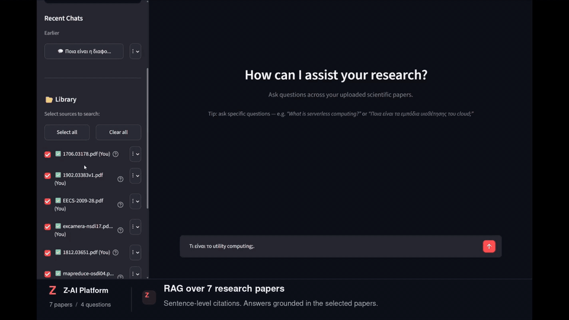

# Z-AI Platform

[](https://github.com/kostas221/local-rag-assistant/actions/workflows/ci.yml)

A **RAG system for scientific papers**: upload PDFs, ask in Greek or English, get answers with page-level citations — and a plain *"not found"* when the papers don't contain the answer. Retrieval runs locally on CPU (bge-m3 + BM25 + cross-encoder); Gemini 2.5 Flash writes the answer.

Built as a diploma thesis, then pushed further under one rule: **no change without a measurement on this project's own data** — including changes that the literature says should work.

> **Head-to-head on the same 137 questions, with the same LLM, graded by two judges from two vendors:**
>
> | | **This system** | Naive RAG | LlamaIndex (defaults) |
> |---|---|---|---|
> | Standard questions answered correctly (45) | **42** | 34 | 26 |
> | Two-paper questions, **both** halves right (29) | **18** | 3 | 2 |
> | Near-miss questions correctly declined (42) | 40 | 41 | 41 |
> | Generation cost per question | 0.47¢ | 0.19¢ | 0.17¢ |
>
> GPT-4.1 judging against reference answers; a Gemini judge gives the same ranking (agreement κ = 0.91). It wins where retrieval is hard, ties where the model's own caution decides, and costs ~2.5× more — [evidence below](#head-to-head-same-questions-same-llm-same-judges).

## Demo



> Upload a PDF, ask in Greek or English, and get grounded answers with page-level citations — plus a clear *"not found"* when the answer isn't in the documents.

## Head-to-head: same questions, same LLM, same judges

Three systems answered the same **137 questions** over the same 7 papers, all with **Gemini 2.5 Flash** writing the answer, so the difference measures the retrieval pipeline — not the model.

| System | What it is |
|---|---|
| **This system** | translate → bge-m3 + BM25 → RRF → cross-encoder → relevance gate → corrective retry → whole pages → per-document search for two-paper questions |
| **Naive RAG** | the tutorial recipe: bge-m3, top-4 chunks. **Same prompt, same chunks, same LLM** as this system — only retrieval differs |
| **LlamaIndex 0.14.25, defaults** | `SimpleDirectoryReader` → `VectorStoreIndex` → `as_query_engine()` — its own chunking, top-2, its own prompt. Only the embedder (bge-m3; the default needs OpenAI) and the LLM are shared |

| | This system | Naive RAG | LlamaIndex |
|---|---|---|---|
| **Standard (45)** — correct, judge 2 (GPT-4.1, vs reference) | **42** | 34 | 26 |
| Standard — 5/5/5/5, judge 1 (Gemini)¹ | **42** | 34 | 30 |
| Standard — "not found" although the answer exists | **1** | 2 | 5 |
| Standard — off-topic questions declined (5) | 5 | 5 | 5 |
| **Two papers (29)** — correct halves, judge 2 | **45/58** | 18/58 | 17/58 |
| Two papers — both halves correct, judge 2 / judge 1 | **18 / 17** | 3 / 3 | 2 / 2 |
| **Near-miss (42)** — correctly declined, judge 2 / judge 1 | 40 / 40 | 41 / 42 | 41 / 41 |
| **Tables (16)** — fully correct · exact values (69) | **16 · 69** | 15 · 63 | 13 · 57 |
| Greek question → Greek answer (18) | 18 | 18 | 16 |
| Generation cost per question (median) | 0.47¢ | 0.19¢ | **0.17¢** |

Per question, paired against this system: **standard 11/3 and 17/1** (wins/losses vs naive and LlamaIndex; p = 0.06 and < 0.001) · **two-paper halves 28/1 and 28/0** · near-miss 1/2 and 0/1 (noise).

**How to read it:**

- **The value of the pipeline is finding the right pages.** On questions that need two papers, the naive and default pipelines answer both halves 2–3 times out of 29; this one 18.
- **Declining is a tie — and not because of the pipeline.** All three decline 40–42 of 42 near-miss questions. With LlamaIndex's generic prompt it is still 41/42, so the caution comes mostly from the model. This system's two misses come from giving the model *more* relevant material (8 pages vs 2–4 chunks); "all PDFs in the prompt" shows the same pattern below.
- **It costs 2.5× more** per question, for the same reason: 8 pages of context. Still under half a cent.

**Fairness notes.** LlamaIndex ran with its **defaults** — a tuned LlamaIndex (hybrid search, a reranker, more context) would close part of the gap, and that tuning is exactly the work being measured. Versions are pinned in [`requirements_compare.txt`](backend/evaluation/requirements_compare.txt); every answer and every judgement is committed under [`runs/compare/`](backend/evaluation/runs/compare).

**Two judges.** Judge 1 is Gemini (as in the rest of the project); judge 2 is GPT-4.1, grading **against the reference answer only**. They agree on 95% of two-paper halves (κ = 0.91) and 99% of near-miss verdicts (κ = 0.85), and rank the systems identically — so the result is not one model grading its own family.

```bash
# answers + judge 1 (in Docker), LlamaIndex in a throwaway container, judge 2 on the host
docker compose run --rm --no-deps backend python -u evaluation/compare_systems.py --system naive
docker compose run --rm --no-deps -u root backend sh -c "pip install -q -r evaluation/requirements_compare.txt && python -u evaluation/compare_llamaindex.py"
docker compose run --rm --no-deps backend python -u evaluation/compare_systems.py --system llamaindex
python backend/evaluation/compare_judge2.py
docker compose run --rm --no-deps backend python evaluation/compare_systems.py --table   # the table above, zero API calls
```

### The judge was rewarding failed retrieval

¹ The first comparison ran with the answer judge this project had used since v1 — and it gave **5/5/5/5 to *"the provided context does not contain this information"*** on questions whose answer *is* in the papers, whenever retrieval had missed the page. Its criteria are relative to the retrieved context, so a failed search followed by an honest refusal looks perfect. Seven such answers (five LlamaIndex, two naive) were scored perfect; raw perfect counts were 42 / 36 / 35.

The rule was corrected (a refusal on an answerable question is not a perfect answer), and the reference-only second judge was added to check the correction. Of the 17 answers that only judge 1 called perfect, **16 belonged to the two baselines** — refusals and half-answers. A context-relative judge is fine for comparing configurations of *one* retriever; across retrievers it rewards the worse one.

### And against "just put all the PDFs in the prompt"

The 7 papers are ~132k tokens and fit in Gemini's context window, so the obvious question is why retrieve at all. The same `ask_ai` was run with all 122 pages instead of 8:

| | RAG (8 pages) | All 122 pages |
|---|---|---|
| Quality (keyword proxy, 3 sets) | equal | equal |
| Near-miss correctly declined | 40/42 | 41/42 |
| Tokens per question | ~10,000 | ~132,000 |
| Cost per question | 0.48¢ | 1.20¢ with 98% served from Gemini's cache (~8.6× without) |
| Time to first token (median / p90) | 3.2 s + ~0.8 s retrieval | 3.9 s / 10.7 s |

**At 7 papers, RAG does not win on quality.** It wins on what long context cannot offer: corpora beyond ~1M tokens, cost that doesn't depend on a cache hit, per-user isolation (one prompt per user means no shared cache), and a gate that stays silent before generating anything. Measured with a keyword proxy on both sides, since an LLM judge would have to read all 132k tokens per verdict.

## Questions that need two papers

The biggest gap found in v2: on 29 questions that name two papers, the page holding the evidence for each half arrived only **30 of 58** times — and when it didn't, the half was answered correctly 6 of 28 times. The answer was being lost in retrieval, not in generation.

The fix is deliberately small. When a question **names at least two papers** (an alias list per paper), the same query is re-run inside each named paper and up to 4 pages are added. No LLM call, and the gate is untouched.

| Two-paper questions (29) | Before | After |
|---|---|---|
| Correct halves | 33/58 | **44/58** (Δ +11, 95% CI [+5, +17]) |
| Both halves correct | 7 | **17** |
| Unsupported halves | 4 | 2 |
| Faithfulness | 4.52 | 4.75 |

Across all 235 scoreboard questions, pages changed **only** in the 41 routed ones; the gate and corrective agent decided identically in 235/235. The routing rule fires on **0 of 170** questions that don't name two papers.

The path there is documented, including the rejected route: an LLM router that decides whether to split a question splits 35 of 50 *standard* questions too — an extra call and ~3 extra pages on almost every question, for the gain a name match gets for free.

## What each pipeline stage actually buys

Every component is justified by an ablation on the **same 45 in-corpus questions**, not by reputation:

| Stage | MRR | Out-of-corpus correctly refused |
|---|---|---|
| Dense only (bge-m3) | 0.731 | 0/5 |
| \+ BM25 via RRF | 0.774 | 0/5 |
| \+ cross-encoder rerank | 0.793 | 0/5 |
| \+ **relevance gate** | 0.793 | **5/5** |

**The gate improves no ranking metric — and is the single most important component.** Without it the system answers *every* question, including the five it has no material for. All the hybrid machinery buys **+8.5% MRR**; one calibrated threshold buys the refusals.

This is only visible because the golden set contains questions with **no answer in the corpus**. Most golden sets don't, which is why they cannot measure the anti-hallucination defence at all.

```bash
docker compose exec backend python evaluation/ablation_ladder.py
```

## Features

- **Hybrid retrieval** — dense semantic search (BAAI/bge-m3, 1024-dim, cosine) fused with lexical BM25 via Reciprocal Rank Fusion (RRF)
- **Exact vector search** — brute-force cosine over the full index instead of ANN. Measured: identical top-30 to HNSW (30/30, same order) with no speed cost at this corpus size, and *deterministic* across processes
- **Cross-encoder reranking** — `ms-marco-MiniLM-L-12-v2` reorders fused candidates. English-only by design: the pipeline translates before retrieval
- **Anti-hallucination relevance gate** — if even the best chunk scores below a *measured* threshold, the system answers "not found" instead of feeding irrelevant context to the LLM
- **Corrective retrieval agent (CRAG)** — when the gate fires, the query is rewritten and a full second pass runs with its own calibrated threshold. Zero cost on the happy path
- **Per-document search for two-paper questions** — questions that name two papers are searched inside each one; no LLM call ([details](#questions-that-need-two-papers))
- **Cross-lingual QA** — Greek questions are translated for retrieval (translate-then-retrieve, domain- and glossary-aware, cached); answers come back in the user's language
- **Inline citations** — `[S3]` markers resolved server-side to (file, page), so the model is never asked to copy a page number — the step that used to go wrong
- **Conversational rewriting** — follow-ups are rewritten into self-contained queries; leak tests confirm an off-topic follow-up is still refused
- **Robust PDF extraction** — PyMuPDF with Unicode NFKC normalization and de-hyphenation (`A WS` → `AWS`, ligatures, line-break hyphens)
- **Evaluation framework** — 8 golden sets in one frozen scoreboard, two LLM judges, paired bootstrap, chance floors, per-stage tracing, determinism checks, head-to-head comparisons
- **Prometheus metrics** — `/metrics` with zero dependencies: gate block rate, corrective success rate, tokens, latency per phase
- **Multi-user** — JWT auth, per-user document isolation enforced in the vector store, rate limiting shared across processes via Postgres

## Architecture

```
┌────────────┐  HTTP   ┌─────────────────────────────────┐
│  Streamlit │ ──────► │            FastAPI               │
│  frontend  │         │                                  │
│   :8502    │         │  /chat ──► RAG pipeline          │
└────────────┘         │  /upload ─► background ingest    │
                       │  /metrics ► Prometheus text      │
                       └──────┬──────────┬───────────┬────┘
                              │          │           │
                       ┌──────▼───┐ ┌────▼─────┐ ┌───▼────────┐
                       │ ChromaDB │ │ Postgres │ │ Gemini 2.5 │
                       │ (chunks, │ │ (users,  │ │   Flash    │
                       │ vectors) │ │  chats)  │ │ (gen+judge)│
                       └──────────┘ └──────────┘ └────────────┘
```

### RAG pipeline (per question)

1. **Query optimization** — Greek questions translated to English search queries with a domain- and glossary-aware prompt (cached, so the same question always yields the same retrieval)
2. **Dense search** — bge-m3, exact cosine over the whole index, top-30
3. **Sparse search** — BM25 with Greek-aware tokenization, top-30
4. **Fusion** — Reciprocal Rank Fusion (k=60), deterministic tie-breaking, top-15
5. **Rerank** — `ms-marco-MiniLM-L-12-v2` cross-encoder, **raw logits**
6. **Relevance gate** — best score below −2.6 → "not found"
7. **Corrective retry** — *only if step 6 fired*: rewrite, re-run 2–5, accept above −3.8 (the rewrite produces noun phrases, whose scores sit lower on this model's scale — calibrated, not guessed)
8. **Page-level expansion** — top chunks map back to whole pages (max 8), so tables and lists arrive intact
9. **Per-document search** — *only if the question names ≥ 2 papers*: steps 2–5 inside each named paper, up to 4 extra pages
10. **Generation** — Gemini 2.5 Flash over REST (thinking budget capped), streamed, with `[S#]` citations

Design decisions and trade-offs behind each step: [`ARCHITECTURE.md`](ARCHITECTURE.md) · the experiment log: [`ENGINEERING_LOG.md`](ENGINEERING_LOG.md)

## Evaluation

Eight golden sets, **235 questions**, over 7 open-access cloud/serverless papers (122 pages, 418 chunks), run as one frozen **scoreboard**: every Gemini call (translations, rewrites) is cached by its full prompt, so two runs differ only if the *system* changed, and every change is reported per question.

| Set | n | What it measures |
|---|---|---|
| `golden_set_50` | 45 + 5 off-topic | the stable baseline |
| `golden_multihop_new` / `_v2` | 11 / 29 | cross-document questions; v2 names two papers and marks the evidence page for each |
| `golden_hard_paraphrase` / `golden_hard_new` | 16 / 59 | deliberately badly-worded and hard questions — stress tests, not baselines |
| `golden_near_ooc` | 42 | **near-miss**: related material exists, the specific answer doesn't |
| `golden_conversations` | 12 | multi-turn, incl. 2 topic-leak probes |
| `golden_tables` | 16 | 69 exact values read from tables |

The PDFs are not redistributed here; all seven are open-access (arXiv, USENIX, UC Berkeley, Google Research). Two more sets probe transfer: `golden_test_domains` (25 questions on two non-CS papers — does the gate calibrated on cloud papers transfer?) and `golden_dangling` (14 questions with the paper's name removed).

```bash
docker compose exec backend python evaluation/scoreboard.py --label mytest --compare evaluation/runs/scoreboard/baseline.json
docker compose exec backend python evaluation/scoreboard_answers.py --set main     # answers + judge
```

### Answer quality

| Set | Result |
|---|---|
| Standard (45 + 5) | **42/45 correct** (judge 2) · judge 1 means 4.90 / 4.80 / 4.92 / 4.96 (accuracy / completeness / relevance / faithfulness) · off-topic **5/5 declined** |
| Two papers (29) | **44/58 halves** correct (judge 1; 45/58 judge 2) · 2/58 unsupported |
| Near-miss (42) | **40/42**: 38 answered "not in the papers", 2 silenced by the gate · 1 soft leak · 1 leak ([limitations](#known-limitations)) |
| Tables (16) | **16/16**, 69/69 exact values |

A single judge run is one draw: the judge itself is not deterministic (2 of 9 identical answers moved by one point between two runs). A label change on one question is not a finding; the per-question comparisons above use paired tests for that reason.

### Every percentage is read against its chance floor

Coverage scores are meaningless without knowing what a *random* retriever would score. Computed analytically (hypergeometric, zero simulation):

| Set | Chance floor | Observed | Margin |
|---|---|---|---|
| `golden_multihop_new` | 22.6% | 98.5% | **+75.9** |
| `golden_set_50` | 33.5% | 98.5% | **+65.0** |
| `golden_conversations` | 41.2% | 90.0% | **+48.8** |

This exercise also **found bugs in the evaluation itself**: 31 keywords in the main set are found on >60% of pages by chance (`serverless` appears on 65 of 122 pages), and one verification tool had been silently crashing on the conversations set, so that set had never been checked at all.

### The relevance gate, measured

| Model | In-corpus min | In-corpus median | Out-of-corpus max | Gap |
|---|---|---|---|---|
| MiniLM-L-6 | −1.80 | 4.15 | −2.69 | 0.89 |
| **MiniLM-L-12** | −2.08 | 4.62 | −3.12 | **1.04** |

The threshold **−2.6** is the midpoint of the range that separated all 61 calibration questions, maximising the *worst-case* margin on both sides. In the current scoreboard two answerable questions are refused on the first pass (`q025`, `q059`); `q025` traces to translation variance upstream of the gate — see [the third finding](#the-third-finding-anything-upstream-of-the-gate-changes-the-gate).

### Determinism

Retrieval is bit-for-bit reproducible across processes. Two sources of non-determinism were found and fixed: `list(set(...))` in the fusion step (iteration order depended on `PYTHONHASHSEED`, with 15 tied RRF scores out of 51 candidates), and ChromaDB's HNSW graph, which was rebuilt from the WAL on every start and did not always return the same top-30. Before the fix, the *same code* produced MRR 0.764 and 0.755.

```bash
docker compose exec backend python evaluation/check_determinism.py
```

### Confidence intervals — and what they disqualify

A **paired bootstrap** (resampling questions, since both configurations saw the same ones) replaced the rule of thumb "don't believe a delta under 0.01":

| L-6 → L-12, same 45 questions | Δ | 95% CI | Verdict |
|---|---|---|---|
| MRR 0.770 → 0.793 | +0.023 | [−0.016, +0.064] | **not proven** |
| nDCG 0.786 → 0.807 | +0.021 | [−0.009, +0.052] | **not proven** |
| Coverage 98.52 → 98.52 | 0.000 | [0.000, 0.000] | **identical in 45/45** |

The noise floor at n=45 is **±0.04, not ±0.01**: most decisions in this project were made in a region where the statistics cannot adjudicate. The reranker upgrade is therefore kept as a **defensible decision, not a proven one** — four converging indications, none significant at its own sample size.

```bash
docker compose exec backend python evaluation/bootstrap_ci.py \
    --compare evaluation/runs/retrieval_l6.csv evaluation/runs/retrieval_l12.csv
```

### Performance

Measured on a Ryzen 7 5700X, CPU only (container: 8 cores).

| | Value |
|---|---|
| Warm retrieval | **846 ms** (rerank 784 = 93%, expand 53, authz 5, BM25 1.4, dense 0.5) |
| End-to-end | 2.8–4.3 s · TTFT 2.78 s |
| Throughput | 1.18 req/s for one user, 1.38 req/s at **4 concurrent users**, where it saturates |

Page expansion went from 8 to 53 ms when a per-user authorization check was added to it — about 1% of end to end, kept. Past saturation the throughput plateaus (~1.0 req/s up to 32 users) and latency grows linearly — Little's law, a queue that works, not a collapse. Per-document search adds two BM25+rerank passes **only** on routed questions; its latency has not been measured on this machine yet.

### Cost

| Per 1,000 questions | |
|---|---|
| Gemini input (9,693 tokens/q) | $2.91 |
| Gemini output (1,112 tokens/q) | $2.78 |
| Embeddings, reranking, BM25 | **$0.00** — local, CPU |
| **Total** | **$5.69** |

A month at that volume costs about **€10**: €5 for a CPU-only VPS plus ~€5 of API. Output tokens cost 8.3× more than input tokens, so the context-size decisions were pulling the *cheap* lever; `THINKING_BUDGET=512` is 21% of the bill — setting it to 0 was measured and dropped one multi-hop answer's faithfulness from 5.0 to **2.0**.

```bash
docker compose exec backend python evaluation/measure_cost.py --ratio 4.53
```

## Technical decisions

What was measured, kept, and — more often — **rejected**. Each row is a real experiment.

### Kept

| Change | Measured effect |
|---|---|
| **Per-document search** for questions naming two papers | Two-paper halves **33 → 44/58** (CI [+5, +17]), both halves **7 → 17/29**; 0/170 false triggers; gate identical 235/235; 0 LLM calls |
| **PyMuPDF + NFKC** instead of pypdf | Broken tokens 3.7% → 2.5%; 721 ligatures and 941 hyphenations eliminated. MRR +0.026 |
| **English reranker** (568M → 22M params) | The pipeline translates *before* retrieval, so the cross-encoder always sees English. Latency 15,048 ms → **693 ms (21.7×)**, accuracy 4.96 → 5.00 |
| **MiniLM-L-6 → L-12** + recalibrating both thresholds | Hard set **10/16 → 12/16** · gate gap 0.89 → **1.04** · correct chunk at rank 1 **36 → 40/56** · corrective hallucinations **2 → 0**. Cost **+9% e2e**. Defensible, not proven |
| **Exact search** instead of HNSW | Identical top-30, no speed cost at 418 vectors, deterministic |
| **Deterministic fusion** | `dict.fromkeys` + tie-break on chunk id. Made every later measurement trustworthy |
| **Reranker threads and `batch_size`** | 667 → **434 ms** with bit-identical scores (thread heuristic under WSL2; padding in one large batch) |
| **Capped thinking budget** (REST) | TTFT 3.90 s → **2.78 s**, judge scores unchanged |
| **Domain-aware translation** | Greek *«μηχανήματα»* had become `machinery` instead of `servers`. The first measurement (+7.74 / +4.14 logits on two questions) turned out to be **leakage**: the prompt's examples were those two questions' answers. The examples were removed; the clean size of the gain was never measured — kept as a design choice, not as a result |
| **Corrective agent** + its own threshold | Silence → correct answer on the questions it targets, **0 hallucinations**, off-topic still 5/5 |
| **Server-side citation labels** (`[S3]` instead of `[file, p.12]`) | With labels written by the model, 10/97 page numbers were wrong — it copied the page number *printed* in the PDF. The labels themselves were right 97/97. What you don't ask the model to produce cannot come out wrong |
| **Rate limiting in Postgres**, **`/metrics`** | Shared across processes, zero new containers |

### Rejected, with numbers

| Change | Result | Why it failed |
|---|---|---|
| **`gte-reranker-modernbert-base`** (150M) | The project's first **proven** ranking gain: MRR 0.785 → **0.874**, CI [+0.025, +0.160] | Rerank **5.5× slower** on CPU (0.59 → 3.26 s), and its compressed score scale weakens the "not here" signal: an off-domain question (volcanology) passed the gate, two hard questions passed with **zero** relevant material. Better ranking, worse refusal |
| **Qwen3-Embedding-0.6B** | Dense top-30 clearly better (both papers present 12 → 17/29) | After fusion and rerank the gain evaporated (7 → 9); every CI crossed zero; pages changed in 221/260 questions — and **two new leaks** at margins of 0.08 and 0.13 logits. Same reranker + same threshold is *not* the same gate |
| **Contextual chunk prefixes** (Anthropic-style Contextual Retrieval / doc2query) | Direction probe, n=33: in-corpus scores **fell** (median −0.85 logits, 22 → 18 above the gate) while an out-of-corpus question rose **+2.72** and crossed it | The direction was wrong on both sides, so the full re-ingest was not run. A technique reported to cut retrieval failures by 49–67% elsewhere, measured here first |
| **Query enrichment with domain terms** (3 variants) | Fixed one hallucination — and **leaked one out-of-corpus question** | Enrichment helps retrieval only when the reranker also sees the added words — exactly when the gate is misled. Architectural, not a bug |
| **LLM router / query decomposition** (Aug and Sep) | Aug: +1 keyword of 45. Sep: decomposition solved the two-paper problem, but the router split **35/50** standard questions too | An extra call and ~3 pages on almost every question. The name-based router keeps the gain with 0 false triggers and no LLM |
| **"Which paper do you mean?" agent** | 12/14 questions stripped of the paper's name were answered normally anyway | On the 2 that needed it, restricting the search to the right paper was *still* refused: restriction removes competitors, it does not raise the gate score |
| **Figure ingestion** (multimodal) | Audit of all 33 figures: **3** (7 generously) carry a fact absent from the text | Below the pre-registered threshold of 10. The authors state each figure's message and numbers in the text; vector diagrams already yield their labels |
| **`bge-reranker-v2-m3` (568M)** | +1 real answer **and** +1 hallucination = net zero, ~15 s/question | More willing to answer without material |
| **`bge-reranker-base` (278M)** | **Worse than the 22M model**: 3/16 hard | Scores out-of-corpus chunks high — discriminability does not scale with size |
| **`RERANK_CANDIDATES` 15 → 12 / 10** | Every summary metric identical | **False economy**: N=12 changed the pages reaching the LLM in **42/56** questions |
| **PyTorch dynamic INT8** | 1.37× faster, Pearson ρ **0.997** | Shifts a correct answer below the gate. **ρ = 0.997 with a broken gate** — correlation is the wrong metric for a reranker |
| **Thinking budget 0** | 2.73× faster TTFT | Faithfulness **5.0 → 2.0** on a multi-hop answer, invisible to keyword coverage |
| **`chunk_size` 750 / 1000** | Main set better, hard set worse — **the sign flips between sets** | The main set is at its coverage ceiling and cannot show the loss |
| **Cascade reranking** | Rejected by arithmetic: 434 + 282 ms > 706 ms | Needs a first stage 10–100× cheaper; here 1.63× |
| **Langfuse**, **pgvector**, **contextual compression**, **BGE-M3 sparse** | Operational cost with no product gain, or no measured problem to solve | Criteria to revisit each are recorded in the log |

### The finding that mattered most

With coverage above 97%, the correct material already reaches the model — **retrieval MRR is decoupled from answer quality** here, and **no intermediate metric predicts the final prompt**. The reranker upgrade left coverage identical in 45/45 questions while **35 of 56** received different pages; `RERANK_CANDIDATES=10` left best-logit, gate gap and keyword@1 identical while changing the pages in **52 of 56**. The prompt is pages, and only one tool looks at them:

```bash
docker compose exec backend python evaluation/compare_pages_rerankers.py
```

### The second finding: your golden set hides your failures, because you wrote it

The gate once scored a perfect **61/61** — and it was false. One question had been written naturally, was refused, and **was deleted from the set**. Sixteen deliberately badly-worded paraphrases then exposed **11/16 wrong refusals**. A production user does not get the option to delete the question that breaks your system. The near-miss set (42) and the hard set (59) exist because of this.

### The third finding: anything upstream of the gate changes the gate

The gate judges the best score *among the candidates it is shown*. A different embedder (Qwen3), a different reranker scale (gte), or a different translation of the same Greek question (`q025`) changes the candidates — and borderline cases flip, in both directions, at margins of a tenth of a logit. Every upstream change is therefore re-tested against the refusal sets, not just the accuracy sets.

### Where a failure actually happens

A per-stage tracer answers "at which step was this page lost?" — translation, dense, BM25, RRF, rerank, gate, or prompt. It is how the two-paper problem was found: 21 of 28 lost evidence pages were lost *before* the reranker ever saw them.

```bash
docker compose exec backend python evaluation/trace_query.py --id q028 --target excamera-nsdi17.pdf:15
```

## Known limitations

- **Two near-miss leaks out of 42.** Asked how the programming language affects AWS autoscaling, the system concludes it doesn't — a synthesis of two facts no paper links (stable across draws). Asked about multi-cloud security "in 2024", it answers about cloud security without saying the specifics are missing (varies between draws). Both follow from giving the model 8 pages of related material; the naive baseline declines both. A claim-level grounding check (e.g. HHEM, MiniCheck) is the natural next experiment
- **Text-layer PDFs only.** A scanned PDF is flagged in the UI as *"no extractable text (scanned PDF — needs OCR)"* instead of silently showing as ready; there is no OCR or layout model. Figures were audited instead of ingested
- **Not measured:** questions about the whole corpus at once ("what do all seven papers say about cold starts?"), multi-step agentic retrieval, and prompt injection hidden in uploaded PDFs (uploads are private to their owner, so an injected document can only mislead its own uploader)
- **Two-paper routing uses hand-written aliases** for the 7 papers; paraphrases ("the video-processing system") and pronouns are not caught. Automatic alias extraction at ingest is open
- **7 papers.** The design is tuned to 418 chunks. Breaking points are measured (BM25 fails first, 6.7× slower than dense at 50k chunks), but quality at 50+ papers is not
- **LLM judges.** Two vendors now agree, but both are LLMs; the golden sets are self-authored and hand-verified, not externally annotated
- **Corrective verification is not reproducible** (a Gemini rewrite with no seed), and its threshold rests on a handful of questions — the midpoint of a range that behaves identically, not an optimum
- **Throughput saturates at 4 concurrent users** on one CPU-bound worker
- **Model availability.** New Gemini API keys no longer get `gemini-2.5-flash`, the model everything here was measured on. `gemini-3.8-flash` was run through the full scoreboard against a pre-registered bar and **did not become the default**: two off-topic questions passed the relevance gate (one through a long, domain-heavy rewrite by the corrective agent), it blocked one harmless prompt (`blockReason: OTHER`), it thinks despite a thinking budget of 0 (which first cut 11/157 translations short), and its translations match 2.5's in only 3/122 Greek questions and are not reproducible between calls. On the plus side it closed the translation regression behind `q025`/`q059` (gate 61/61). Ranking changes were all within noise (paired bootstrap). It costs ~2.4× per question at current prices
- **`google.generativeai` is deprecated** and `google-genai` needs Pydantic 2, incompatible with the pinned stack — generation uses the REST endpoint directly

## Quickstart

Requirements: Docker Desktop (WSL2 backend on Windows), a [Gemini API key](https://aistudio.google.com/apikey).

```bash
git clone https://github.com/kostas221/local-rag-assistant.git
cd local-rag-assistant
cp .env.example .env        # fill in your keys
docker compose up -d --build
```

> **New Gemini API key?** Google no longer offers `gemini-2.5-flash` to new keys, and the app will only show a generic AI error. Add this line to `.env`:
>
> ```
> GEMINI_MODEL=gemini-3.8-flash
> ```
>
> Checked end to end (a Greek question answered with citations, an off-topic one refused). Every number in this README was measured on 2.5 Flash, though — on the full scoreboard 3.8 is not a drop-in replacement; see [Known limitations](#known-limitations).

First start downloads the embedding + reranker models (~2.5 GB, cached in a volume afterwards).

- UI: http://localhost:8502 — register, upload a PDF, wait for "ready", ask away
- API docs: http://localhost:8010/docs
- Metrics: http://localhost:8010/metrics

## Configuration

| Variable | Purpose |
|---|---|
| `GEMINI_API_KEY` | Gemini API key (generation, translation, judge 1) |
| `GEMINI_MODEL` | Model for translation, rewrites and answers. Default `gemini-2.5-flash` (what everything was measured on); new keys need `gemini-3.8-flash` |
| `JUDGE_MODEL` | Model of judge 1 in the evaluation scripts (default `gemini-2.5-flash`, pass with `docker compose exec -e`). Separate from `GEMINI_MODEL`, so testing a new model does not also change the judge |
| `OPENAI_API_KEY` | only for the second judge (`compare_judge2.py`) |
| `POSTGRES_PASSWORD` | Postgres password |
| `SECRET_KEY` | JWT signing key — `openssl rand -hex 32` |
| `RERANKER_MODEL` | Cross-encoder. **Changing it requires recalibrating `MIN_RERANK_SCORE`** |
| `MIN_RERANK_SCORE` | Relevance gate, in **raw logits** (`evaluation/measure_gate_margin.py`) |
| `ENABLE_CORRECTIVE`, `CORRECTIVE_MIN_SCORE` | Corrective agent and its threshold |
| `ENABLE_PERDOC`, `PERDOC_EXTRA` | Per-document search for two-paper questions, and how many pages it may add |
| `DENSE_CANDIDATES`, `RERANK_CANDIDATES`, `EXPAND_INPUT`, `MAX_PAGES` | Pipeline depths |

## Tests & evaluation

```bash
docker compose exec backend python -m pytest tests/ -q     # 116 tests; 73 need neither models nor Postgres

docker compose exec backend python evaluation/scoreboard.py            # all 8 sets, frozen, per-question diff
docker compose exec backend python evaluation/check_determinism.py
docker compose exec backend python evaluation/random_coverage_baseline.py
docker compose exec backend python evaluation/ablation_ladder.py
docker compose exec backend python evaluation/trace_query.py --id q028
docker compose exec backend python evaluation/compare_pages_rerankers.py
docker compose exec backend python evaluation/measure_gate_margin.py
docker compose run --rm --no-deps backend python evaluation/compare_systems.py --table   # head-to-head, 0 API calls
```

## Project structure

```
backend/
  ai_core.py            # RAG pipeline: ingest, hybrid search, rerank, gate, corrective, generation
  doc_routing.py        # which papers a question names -> per-document search
  corpus_names.json     # aliases per paper (the measured list)
  gemini_rest.py        # streaming generation over REST — thinking budget control
  rate_limit.py         # cross-process rate limiting in Postgres
  metrics.py            # Prometheus text exposition, zero dependencies
  main.py               # FastAPI: auth, documents, conversations, chat streaming
  evaluation/
    golden_*.jsonl               # 8 scoreboard sets + domains + dangling
    scoreboard.py                # all sets, one frozen run, per-question diff
    scoreboard_answers.py        # answers + judges per set
    compare_systems.py           # naive / LlamaIndex vs this system, paired tests
    compare_llamaindex.py        # LlamaIndex with defaults (throwaway container)
    compare_judge2.py            # second judge (OpenAI), agreement (κ)
    probe_*.py                   # one experiment each — prediction and result in the docstring
    runs/                        # every result, including the rejected ones
  tests/                # 116 tests
frontend/
  app_ui.py             # Streamlit chat UI
docker-compose.yml      # postgres + backend + frontend
```

## Tech stack

FastAPI · Streamlit · ChromaDB · PostgreSQL · sentence-transformers (bge-m3, ms-marco-MiniLM) · rank-bm25 · PyMuPDF · Gemini 2.5 Flash · Docker Compose · evaluated against LlamaIndex, with GPT-4.1 as a second judge
